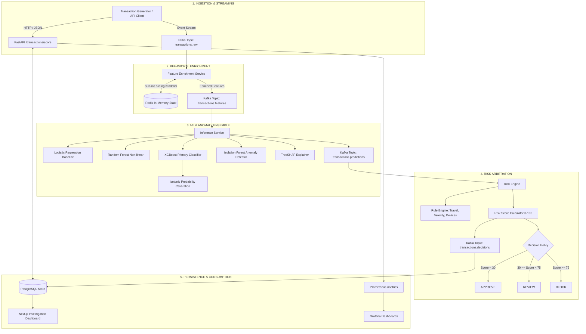

# Real-Time Payment Fraud Detection & Risk Engine

[](https://www.python.org/downloads/)
[](https://fastapi.tiangolo.com)
[](https://nextjs.org/)
[](https://kafka.apache.org/)
[](https://redis.io/)
[](https://www.postgresql.org/)
[](https://xgboost.readthedocs.io/)
[](https://opensource.org/licenses/MIT)

> **Flagship Production-Grade Portfolio Project**  
> A high-throughput, low-latency streaming pipeline combining **Machine Learning, Behavioral Analytics, Anomaly Detection, and Business Rules** to score and triage credit card transactions into **APPROVE**, **REVIEW**, or **BLOCK** decisions with full SHAP explainability.

---

## 1. System Architecture



---

## 2. Core Technical Components

### Machine Learning Core
- **Temporal Split Validation**: Strict chronological splitting ($T_{\text{train}} \le t_1 < T_{\text{val}} \le t_2 < T_{\text{test}}$) to ensure models are tested on future data without retrospective contamination.
- **Leakage Prevention**: All rolling behavioral aggregations (e.g., historical standard deviation of transaction amount) are computed strictly on transactions timestamped *prior* to the evaluation event.
- **Model Hierarchy**:
  - `DummyClassifier`: Majority-class baseline.
  - `LogisticRegression`: Interpretable linear baseline with L2 regularization.
  - `RandomForestClassifier`: Non-linear tree ensemble baseline.
  - `XGBoostClassifier`: Primary champion model trained with gradient boosting, weighted positive loss scaling (`scale_pos_weight`), and optimized tree depth.
- **Probability Calibration**: Platt Scaling (logistic sigmoid) and Isotonic Regression to map distorted decision margins into reliable empirical probabilities, evaluated via Brier Score and Reliability Diagrams.
- **Unsupervised Anomaly Detection**: Isolation Forest computing structural outlier scores independent of fraud labels.
- **Explainable AI (SHAP)**: Real-time TreeSHAP contribution values detailing top positive (risk-increasing) and negative (risk-decreasing) features for every transaction.

### System Core
- **Apache Kafka**: Decoupled message bus maintaining immutable event streams (`transactions.raw`, `transactions.features`, `transactions.predictions`, `transactions.decisions`, `transactions.feedback`, and `transactions.dlq`).
- **Redis (In-Memory Online State)**: Microsecond-latency sliding windows (sorted sets `ZSET` and hash counters) storing velocity counts (1m, 5m, 1h, 24h), moving averages, known device sets, and country histories.
- **PostgreSQL**: ACID-compliant durable storage for transaction payloads, enriched features, risk scores, rule triggers, SHAP vectors, and audit logs.
- **FastAPI**: Asynchronous Python backend exposing REST endpoints, Pydantic data validation, OpenAPI specifications, and Prometheus metrics.
- **Next.js 14 & Tailwind CSS**: Professional real-time fintech dashboard displaying live transaction feeds, deep-dive forensic investigation views, customer profiles, and interactive SHAP waterfall plots.
- **Prometheus & Grafana**: System observability (latency p50/p95/p99, throughput, Kafka lag) and ML telemetry (score distributions, fraud rates, feature drift).

---

## 3. Directory Layout

```text
payment-fraud-engine/
├── README.md               # Master project overview & architectural guide
├── PRD.md                  # Product Requirements Document
├── AGENTS.md               # Directives for AI coding agents
├── GEMINI.md               # Specific instructions for Antigravity/Gemini
├── CLAUDE.md               # Specific instructions for Claude agents
├── CONTRIBUTING.md         # Contribution and branching conventions
├── CHANGELOG.md            # Semantic version log of changes
├── .env.example            # Environment configuration template
├── docker-compose.yml      # Multi-container orchestration
│
├── docs/                   # Exhaustive project documentation
│   ├── ARCHITECTURE.md     # Sequence flows, boundaries, failure modes
│   ├── INFRASTRUCTURE.md   # Network, ports, volumes, dependencies
│   ├── DATABASE.md         # Schema, indexing, Redis vs. Postgres
│   ├── API.md              # OpenAPI specs, contracts, sample payloads
│   ├── ML_PIPELINE.md      # Training lifecycle, temporal splitting
│   ├── FEATURE_ENGINEERING.md # Feature catalogue & leakage rules
│   ├── RISK_ENGINE.md      # Multi-signal arbitration & cost model
│   ├── STREAMING.md        # Kafka topics, consumer groups, idempotency
│   ├── SECURITY.md         # Threat model, synthetic identifiers
│   ├── OBSERVABILITY.md    # Prometheus metrics, Grafana dashboards
│   ├── TESTING.md          # Multi-tier testing guide & execution
│   ├── DEPLOYMENT.md       # Local compose and production blueprint
│   ├── MODEL_CARD.md       # Model capabilities, biases, and limits
│   ├── EXPERIMENTS.md      # Quantitative experiment logs
│   ├── DECISIONS.md        # Architectural Decision Records (ADRs)
│   └── INTERVIEW_QUESTIONS.md # 50+ deep-dive technical interview Q&As
│
├── data/                   # Data storage (raw, processed, synthetic)
├── ml/                     # ML training, calibration, and inference code
├── services/               # Microservices (Generator, Feature, Inference, Risk, API)
├── frontend/               # Next.js 14 forensic dashboard
├── database/               # SQL migrations and DDL schemas
├── infrastructure/         # Dockerfiles and service configurations
├── monitoring/             # Prometheus and Grafana dashboards
└── tests/                  # Unit, integration, and E2E test suites
```

---

## 4. Quick Start (Local Development)

### 1. Prerequisites
- Docker Engine 24+ & Docker Compose v2+
- Python 3.11+
- Node.js 18+

### 2. Environment Initialization
```bash
cp .env.example .env
```

### 3. Launching Backing Services
```bash
docker compose up -d postgres redis kafka zookeeper
```

### 4. Running the Complete System
```bash
docker compose up --build
```
Once healthy:
- **FastAPI Documentation**: [http://localhost:8000/docs](http://localhost:8000/docs)
- **Next.js Investigation Dashboard**: [http://localhost:3000](http://localhost:3000)
- **Prometheus UI**: [http://localhost:9090](http://localhost:9090)
- **Grafana Metrics**: [http://localhost:3001](http://localhost:3001) (Credentials: `admin`/`admin`)

---

## 5. Risk Scoring & Decision Arbitration

The risk engine computes a continuous score $S \in [0, 100]$:

$$S = 100 \times \left( w_{\text{ML}} \cdot P_{\text{calibrated}} + w_{\text{anomaly}} \cdot S_{\text{anomaly}} + w_{\text{behavior}} \cdot S_{\text{behavior}} + w_{\text{rules}} \cdot S_{\text{rules}} \right)$$

Where default weights sum to $1.0$:
- $w_{\text{ML}} = 0.55$: Calibrated XGBoost probability.
- $w_{\text{anomaly}} = 0.15$: Normalized Isolation Forest outlier score.
- $w_{\text{behavior}} = 0.15$: Multi-factor velocity and amount z-score deviations.
- $w_{\text{rules}} = 0.15$: Deterministic triggers (impossible travel, unknown device).

### Automated Actions
- **APPROVE** ($S < 30.0$): Instant fulfillment.
- **REVIEW** ($30.0 \le S < 75.0$): Queued for analyst manual verification or step-up MFA.
- **BLOCK** ($S \ge 75.0$): High probability fraud intercepted immediately.

---

## 6. Honest Scope & Limitations
- **Synthetic Identifiers**: Uses synthetic PAN tokens, customer IDs, and merchant tokens. No live credit card credentials or sensitive financial data are ingested.
- **Throughput Profile**: Optimized for single-node development and medium cluster deployment ($\sim 500$ to $2,000$ transactions/sec). Does not claim global Visa-scale ($65,000+$ TPS).
- **PCI Scope**: Designed according to security best practices (tokenization, least-privilege, encrypted network transit) but is a portfolio simulation and not formally PCI-DSS certified.
