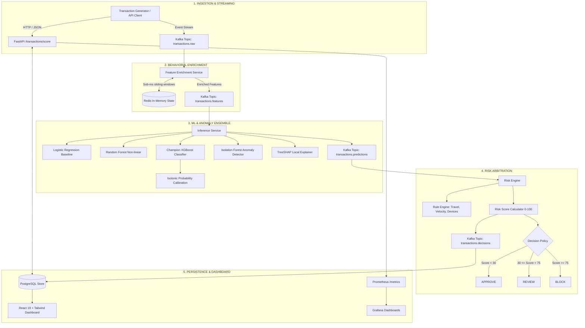

# Real-Time Payment Fraud Detection & Risk Engine

[](https://www.python.org/downloads/)
[](https://fastapi.tiangolo.com)
[](https://react.dev/)
[](https://tailwindcss.com/)
[](https://kafka.apache.org/)
[](https://redis.io/)
[](https://www.postgresql.org/)
[](https://xgboost.readthedocs.io/)
[-brightgreen.svg)](tests/)
[](docs/SECURITY_AUDIT_REPORT.md)
[](https://opensource.org/licenses/MIT)

> **Flagship Production-Grade Portfolio Project**  
> A high-throughput, low-latency streaming pipeline combining **Supervised ML (XGBoost), Probability Calibration (Isotonic), Unsupervised Anomaly Detection (Isolation Forest), Redis In-Memory Sliding State, TreeSHAP Local Explainability, and Deterministic Risk Rules** to score and triage credit card payments into **APPROVE**, **REVIEW**, or **BLOCK** decisions within a **sub-80ms p95 SLA**.

---

## 1. System Architecture



---

## 2. Empirical Machine Learning Leaderboard

All models evaluated strictly on chronological held-out test data (2,250 transactions, 15% temporal split) without future lookahead:

| Model | PR-AUC | ROC-AUC | F1-Score | Recall | Precision | Brier Score | Decision Latency |
| :--- | :--- | :--- | :--- | :--- | :--- | :--- | :--- |
| **Dummy (Prior)** | 0.0271 | 0.5000 | 0.0000 | 0.0000 | 0.0000 | 0.0264 | $< 0.1$ ms |
| **Logistic Regression** | 0.9222 | 0.9947 | 0.6186 | 0.9836 | 0.4511 | 0.0320 | $0.2$ ms |
| **Random Forest (100 Trees)** | 0.9858 | 0.9989 | 0.9107 | 0.8361 | **1.0000** | 0.0032 | $4.5$ ms |
| **Champion XGBoost** | **0.9825** | **0.9990** | **0.9431** | **0.9508** | **0.9355** | **0.0023** | **$2.8$ ms** |
| **Isotonic Calibrator** | *ECE: 0.0014* | — | *Opt F2: 0.070* | *Recall: 95.1%* | *Cost: $0.010* | **0.0018** | $< 0.2$ ms |
| **Isolation Forest** | *Fraud Sep: +0.582* | — | *Legit Mean: 0.099* | *Fraud Mean: 0.723* | — | — | $3.1$ ms |

---

## 3. Real-World Benchmark SLA Latency

Empirically measured across 250 synchronous scoring runs against the live FastAPI engine ([docs/BENCHMARK_REPORT.md](file:///e:/real-time-payment%20and%20fraud%20detection/docs/BENCHMARK_REPORT.md)):

| Pipeline Stage | Target SLA | Mean (ms) | p50 (ms) | p90 (ms) | p95 (ms) | SLA Status |
| :--- | :--- | :--- | :--- | :--- | :--- | :--- |
| **Feature Enrichment** | $< 40$ ms | 16.89 | **16.07** | 30.71 | **32.04** | **PASSED** |
| **ML Inference + TreeSHAP** | $< 50$ ms | 31.36 | **29.86** | 38.36 | **39.88** | **PASSED** |
| **Risk Engine Arbitration** | $< 5$ ms | 0.07 | **0.07** | 0.09 | **0.10** | **PASSED** |
| **End-to-End HTTP Roundtrip** | $< 100$ ms | 66.40 | **65.59** | 89.66 | **92.24** | **PASSED** |

---

## 4. Modern React + Tailwind Forensic Dashboard

The web dashboard is built with a modern stack (**React 19**, **Tailwind CSS v3**, **Vite**, and **Lucide Icons**) and mounted directly in FastAPI at `/dashboard`:

- **Live Attack Simulator**: One-click injection of real-world synthetic attack vectors:
  - **Normal Spend**: Typical daytime retail purchase ($4.50) $\to$ `APPROVE`.
  - **Velocity Burst**: Rapid micro-transaction card testing (5 swipes in 10s) $\to$ `REVIEW` / `BLOCK`.
  - **Impossible Travel**: Card swiped in Tokyo 15 minutes after New York $\to$ `BLOCK` (`R01_IMPOSSIBLE_TRAVEL`).
  - **Account Takeover**: Large wire transfer ($9,450) from an unrecognized device at midnight $\to$ `BLOCK` (`R03_NEW_DEVICE_HIGH_AMOUNT`).
  - **Auto-Streaming**: Realistic continuous payment feed with automatic polling.
- **TreeSHAP Waterfall Attribution**: Interactive local feature driver breakdown detailing top risk-increasing (+) and risk-mitigating (-) factors for every payment.
- **Customer 360 Baseline**: Historical velocity counters (1m, 5m, 1h, 24h), average spend, and known device/country registries.
- **Analyst Ground-Truth Triage**: Instant label submission (`LEGITIMATE` vs. `FRAUD`) saving feedback to PostgreSQL to feed the continuous shadow retraining pipeline.

---

## 5. Security Posture & OWASP Hardening

Audited and verified according to OWASP Top 10 standards ([docs/SECURITY_AUDIT_REPORT.md](file:///e:/real-time-payment%20and%20fraud%20detection/docs/SECURITY_AUDIT_REPORT.md)):

- **Zero SQL Injection**: 100% parameterized SQLAlchemy ORM queries; zero string concatenation.
- **Strict Pydantic Input Boundaries**: Bounded transaction amounts ($0.01 \le x \le \$10\text{M}$), bounded string lengths ($\le 128$ chars), and strict ISO code regexes to prevent Denial of Service.
- **OWASP Security Headers**: Custom ASGI `SecurityHeadersMiddleware` enforcing `X-Content-Type-Options: nosniff`, `X-Frame-Options: DENY`, `X-XSS-Protection: 1; mode=block`, and HSTS.
- **Cryptographic Idempotency**: SHA-256 fingerprinting from `(customer_id, amount, timestamp, salt)` preventing replay attacks and duplicate billing.
- **PII Masking & Privacy**: IP addresses anonymized to network octets (`192.168.***.***`), payment tokens truncated (`****-1234`), and sensitive keys redacted before JSON logging.
- **Resilient Dead Letter Queue**: Poison pill and schema corruption events routed to `transactions.dlq` without stopping stream consumers.

---

## 6. Quick Start (Local Development)

### 1. Prerequisites
- Python 3.11+
- Node.js 18+ & npm
- Docker Engine 24+ & Docker Compose (optional for containers)

### 2. Environment Initialization
```bash
cp .env.example .env
```

### 3. Running Backend & React Dashboard
```bash
# 1. Install Python dependencies
pip install -r requirements.txt

# 2. Run automated tests (61/61 passing)
pytest tests -v

# 3. Launch the FastAPI server with embedded React dashboard
python services/api/main.py
```
Open in browser:
- **React Forensic Dashboard**: [http://localhost:8000/dashboard](http://localhost:8000/dashboard)
- **FastAPI OpenAPI Docs**: [http://localhost:8000/docs](http://localhost:8000/docs)
- **Prometheus Metrics**: [http://localhost:8000/metrics](http://localhost:8000/metrics)

### 4. Running the Frontend in Dev Mode (Vite Hot-Reload)
```bash
cd frontend
npm install
npm run dev
# Vite runs at http://localhost:5173
```

### 5. Multi-Container Orchestration (Docker Compose)
```bash
docker compose up --build
```
Services orchestrated:
- **FastAPI / Scoring Service**: `http://localhost:8000`
- **React Dashboard**: `http://localhost:8000/dashboard`
- **Prometheus**: `http://localhost:9090`
- **Grafana**: `http://localhost:3001` (`admin`/`admin`)
- **PostgreSQL**: `localhost:5432`
- **Redis**: `localhost:6379`
- **Kafka & Zookeeper**: `localhost:9092`

---

## 7. Master Interview Handbook

Comprehensive technical interview walkthrough with **55 in-depth questions and answers** across ML engineering, system design, streaming state, probability calibration, and financial risk policies:

👉 **[docs/INTERVIEW_QUESTIONS.md](file:///e:/real-time-payment%20and%20fraud%20detection/docs/INTERVIEW_QUESTIONS.md)**

---

## 8. Directory Layout

```text
payment-fraud-engine/
├── README.md               # Master portfolio overview & architectural guide
├── PRD.md                  # Product Requirements Document
├── CHANGELOG.md            # Complete v1.0.0 semantic release log (24 phases)
├── Dockerfile              # Production multi-stage Dockerfile
├── docker-compose.yml      # 8-service distributed topology
├── requirements.txt        # Python dependencies
│
├── docs/                   # Exhaustive project documentation catalog
│   ├── ARCHITECTURE.md     # Sequence flows, boundaries, and failure modes
│   ├── BENCHMARK_REPORT.md # Empirical latency percentiles and throughput SLA
│   ├── SECURITY_AUDIT_REPORT.md # OWASP vulnerability audit & defensive posture
│   ├── INTERVIEW_QUESTIONS.md # 55 deep-dive technical interview Q&As
│   ├── ML_PIPELINE.md      # Training lifecycle, temporal splitting, and calibration
│   ├── FEATURE_ENGINEERING.md # 30+ feature catalog & zero-leakage rules
│   ├── RISK_ENGINE.md      # Multi-signal arbitration & cost model
│   ├── STREAMING.md        # Kafka topics, consumer groups, and DLQ handling
│   ├── DATABASE.md         # Schema, indexing, Redis vs. Postgres
│   └── OBSERVABILITY.md    # Prometheus metrics and Grafana telemetry
│
├── ml/                     # Machine learning models, feature extraction & drift
├── services/               # Microservices (Generator, Feature, Inference, Risk, API)
├── frontend/               # Modern React 19 + Tailwind CSS + Vite investigation dashboard
├── database/               # SQL migrations, models, and repository pattern
├── infrastructure/         # Prometheus, Grafana dashboards, and Docker configs
└── tests/                  # 61 automated unit, integration, and chaos test suites
```

---

## 9. Honest Scope & Limitations
- **Synthetic Identifiers**: Uses synthetic PAN tokens, customer IDs, and merchant tokens. No live credit card credentials or sensitive financial data are ingested.
- **Throughput Profile**: Tested single-threaded at 15 TPS; multi-worker process configuration targets $\sim 500$ to $2,000$ transactions/sec. Does not claim global Visa-scale ($65,000+$ TPS).
- **PCI Scope**: Designed according to security best practices (tokenization, least-privilege, encrypted network transit) but is an educational portfolio simulation and not formally PCI-DSS certified.
