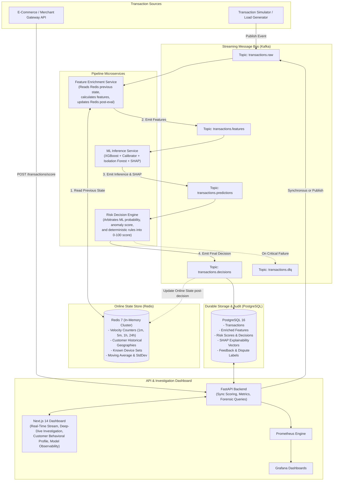
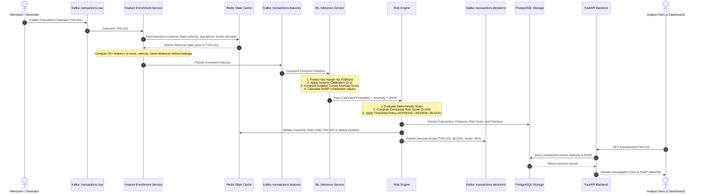

# System Architecture Specification

---

## 1. Executive Architectural Overview

The **Real-Time Payment Fraud Detection & Risk Engine** is an event-driven, distributed fraud decision platform designed to evaluate financial transactions under strict latency bounds ($< 60$ ms p95). 

The platform separates:
1. **Asynchronous streaming ingestion and stateful enrichment** (Kafka, Redis),
2. **Stateless machine learning and anomaly inference** (XGBoost, Isolation Forest, SHAP),
3. **Deterministic policy arbitration and cost-sensitive scoring** (Risk Engine), and
4. **Synchronous query interfaces and forensic audit trails** (FastAPI, PostgreSQL, Next.js).

---

## 2. Component Responsibilities & Service Boundaries

| Service / Component | Runtime | Primary Responsibility | Data Read | Data Write |
| :--- | :--- | :--- | :--- | :--- |
| **Transaction Generator** | Python (asyncio) | Generates synthetic transactions with realistic customer/merchant profiles, injecting controlled fraud scenarios (velocity attacks, impossible travel, high-amount anomalies). | Synthetic profile registry | Kafka (`transactions.raw`) |
| **Feature Enrichment Service** | Python (Kafka Consumer) | Ingests raw events, retrieves historical customer/device state from Redis *before* mutating it, computes $\ge 25$ features, and forwards enriched vectors. | Kafka (`transactions.raw`), Redis | Kafka (`transactions.features`) |
| **ML Inference Service** | Python (XGBoost, SHAP) | Loads active champion model artifacts, runs classification, evaluates probability calibration (Isotonic), scores unsupervised anomaly (Isolation Forest), and computes SHAP vectors. | Kafka (`transactions.features`), Local Model Registry | Kafka (`transactions.predictions`) |
| **Risk Decision Engine** | Python | Evaluates deterministic business rules, normalizes signals, runs multi-factor weighted arbitration, assigns risk score (0–100), and classifies into `APPROVE`, `REVIEW`, or `BLOCK`. | Kafka (`transactions.predictions`) | Kafka (`transactions.decisions`), PostgreSQL, Redis (mutates state) |
| **FastAPI Backend** | Python (Uvicorn, AsyncPG) | Exposes synchronous scoring endpoints (`/transactions/score`), forensic query endpoints for analyst dashboard, and Prometheus metrics. | PostgreSQL, Redis, Model Registry | PostgreSQL, Kafka |
| **Next.js 14 Dashboard** | TypeScript, React, Tailwind | Renders live transaction stream, forensic investigation view with SHAP waterfall plots, customer profiles, and model performance curves. | FastAPI REST Endpoints | FastAPI (Dispute label submissions) |
| **PostgreSQL** | Relational RDBMS | Durable storage of all evaluated transactions, features, model versions, audit logs, and feedback labels. | Read by FastAPI / Analysts | Written by Risk Engine / API |
| **Redis** | In-Memory Key-Value Store | Microsecond sliding-window state storage (velocity counts, device sets, historical spend statistics). | Read by Feature Service | Mutated post-evaluation |

---

## 3. Transaction Sequence Flow

The following sequence diagram outlines the lifecycle of an incoming payment transaction:

---

## 4. Synchronous vs. Asynchronous Communication Boundaries

1. **Asynchronous Streaming Path (Core Transaction Pipeline)**:
   - Utilizes Apache Kafka for durable, partitioned, at-least-once message delivery.
   - De-couples feature extraction from machine learning inference and rule execution.
   - Ensures backpressure absorption during sudden transaction bursts (e.g., Black Friday peak loads).
2. **Synchronous HTTP Path (API & Dashboard)**:
   - Direct `POST /transactions/score` endpoint provided for clients requiring an immediate synchronous HTTP response.
   - The API evaluates the transaction in-process using cached model instances and Redis, returns the decision synchronously, and asynchronously dispatches the event to Kafka/PostgreSQL for durable audit.
   - All dashboard operations (investigation lookup, customer profile, model performance stats) query PostgreSQL via FastAPI asynchronously.

---

## 5. Failure Paths & Graceful Degradation

| Failure Mode | Impact | Recovery / Mitigation Strategy |
| :--- | :--- | :--- |
| **Redis Inaccessible / Timeout** | Real-time sliding window features (1h velocity, z-scores) unavailable. | **Degraded Feature Mode**: System falls back to payload-only features (amount, time of day, MCC), flags transaction as `DEGRADED_STATE`, increases base rule suspicion, and logs critical alert. |
| **Kafka Broker Failure** | Event buffer unavailable for streaming pipeline. | Transactions submitted via synchronous API fail over to local synchronous evaluation and append-only write to PostgreSQL with immediate alert dispatch. |
| **ML Inference Crash / OOM** | ML models unable to produce calibrated probability. | **Deterministic Fallback**: Risk Engine triggers rule-only evaluation mode. If transaction amount $> 3 \times$ customer ceiling or foreign country, transaction defaults to `REVIEW`. |
| **PostgreSQL Write Latency** | Audit persistence slowed. | Asynchronous batch commits via connection pooling (`AsyncPG`). Transient DB disconnects buffer decisions in Kafka topics until reconnected. |
| **Malformed Payload / Schema Drift** | Unparseable transaction JSON. | Event rejected immediately to `transactions.dlq` (Dead Letter Queue) with explicit error payload and stack trace for operator analysis. |

---

## 6. Scalability & Partitioning Strategy

1. **Kafka Partitioning**:
   - Topics are partitioned by `customer_id`.
   - **Critical Property**: Partitioning by `customer_id` guarantees that all transactions for a given customer arrive at the Feature Service strictly in chronological order, eliminating out-of-order state race conditions.
2. **Redis In-Memory State**:
   - Customer keys are hashed (`customer:{customer_id}:*`). Redis cluster hash slots distribute state evenly across memory nodes.
   - Sliding windows utilize sorted sets (`ZREMRANGEBYSCORE` and `ZADD`) with an automatic TTL of 30 days to bound memory growth.
3. **Stateless Service Scaling**:
   - Feature Enrichment, ML Inference, and Risk Engine consumers can scale horizontally up to the number of Kafka topic partitions.
