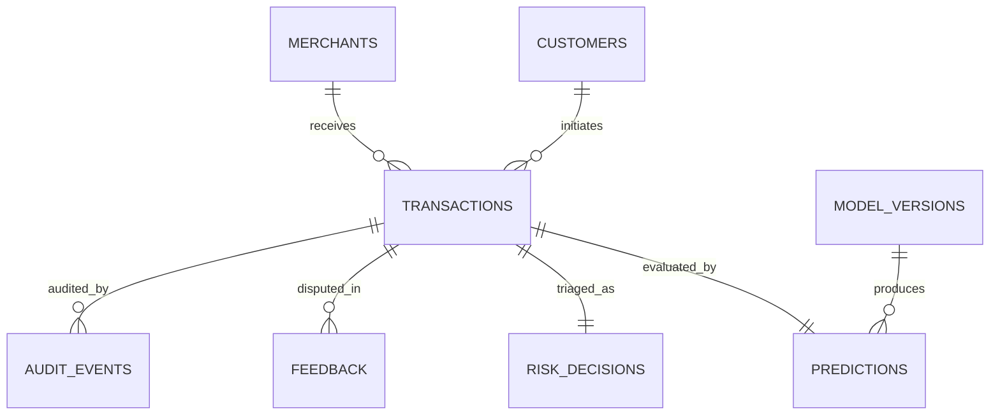

# Database Architecture & Storage Specification

---

## 1. Storage Strategy: PostgreSQL vs. Redis Separation of Concerns

The fraud detection architecture enforces a strict division of responsibilities between **in-memory ephemeral state (Redis)** and **relational durable storage (PostgreSQL)**:

| Dimension | Redis (In-Memory State) | PostgreSQL 16 (Durable Data Store) |
| :--- | :--- | :--- |
| **Primary Role** | Sub-millisecond state enrichment for real-time inference. | Source of truth, forensic investigation, audit trails, and retraining. |
| **Data Types** | Sorted sets (`ZSET`), counters, bitsets, sliding-window hashes. | Normalized relational records, JSONB feature vectors, indexed foreign keys. |
| **Read Latency** | $< 1$ millisecond (p99). | $5 - 20$ milliseconds. |
| **Write Pattern** | High frequency, ephemeral sliding windows (TTL bounded). | Transactional append-only inserts with ACID compliance. |
| **Durability** | Ephemeral cache with RDB/AOF fallback. | Persistent disk storage with WAL logs and point-in-time recovery. |
| **Data Retention** | 1 to 90 days (sliding windows expire automatically). | Multi-year compliance audit logs and historical labels. |

---

## 2. PostgreSQL Relational Schema Specification

### 2.1 Entity Relationship Diagram



---

### 2.2 Table Definitions

#### `customers`
Stores synthetic customer profiles, baselines, and historical registration metadata.
```sql
CREATE TABLE customers (
    customer_id VARCHAR(64) PRIMARY KEY,
    created_at TIMESTAMP WITH TIME ZONE DEFAULT CURRENT_TIMESTAMP NOT NULL,
    home_country VARCHAR(2) NOT NULL,
    home_city VARCHAR(64) NOT NULL,
    average_amount NUMERIC(12, 2) DEFAULT 0.00 NOT NULL,
    std_amount NUMERIC(12, 2) DEFAULT 0.00 NOT NULL,
    typical_hour_start SMALLINT DEFAULT 8 NOT NULL,
    typical_hour_end SMALLINT DEFAULT 22 NOT NULL,
    status VARCHAR(20) DEFAULT 'ACTIVE' NOT NULL
);
CREATE INDEX idx_customers_status ON customers(status);
```

#### `merchants`
Stores synthetic merchant business categorization and geographic presence.
```sql
CREATE TABLE merchants (
    merchant_id VARCHAR(64) PRIMARY KEY,
    name VARCHAR(128) NOT NULL,
    category VARCHAR(64) NOT NULL,
    mcc_code VARCHAR(4) NOT NULL,
    country VARCHAR(2) NOT NULL,
    city VARCHAR(64) NOT NULL,
    risk_tier VARCHAR(16) DEFAULT 'STANDARD' NOT NULL,
    created_at TIMESTAMP WITH TIME ZONE DEFAULT CURRENT_TIMESTAMP NOT NULL
);
CREATE INDEX idx_merchants_mcc ON merchants(mcc_code);
```

#### `transactions`
Immutable log of incoming payment transactions.
```sql
CREATE TABLE transactions (
    transaction_id VARCHAR(64) PRIMARY KEY,
    timestamp TIMESTAMP WITH TIME ZONE NOT NULL,
    customer_id VARCHAR(64) NOT NULL REFERENCES customers(customer_id),
    merchant_id VARCHAR(64) NOT NULL REFERENCES merchants(merchant_id),
    amount NUMERIC(12, 2) NOT NULL,
    currency VARCHAR(3) NOT NULL,
    country VARCHAR(2) NOT NULL,
    city VARCHAR(64) NOT NULL,
    device_id VARCHAR(64) NOT NULL,
    payment_method VARCHAR(32) NOT NULL,
    ip_address INET,
    idempotency_key VARCHAR(128) UNIQUE NOT NULL,
    created_at TIMESTAMP WITH TIME ZONE DEFAULT CURRENT_TIMESTAMP NOT NULL
);
CREATE INDEX idx_transactions_customer_time ON transactions(customer_id, timestamp DESC);
CREATE INDEX idx_transactions_merchant_time ON transactions(merchant_id, timestamp DESC);
CREATE INDEX idx_transactions_timestamp ON transactions(timestamp DESC);
```

#### `predictions`
Captures model inference outputs, probabilities, anomaly scores, and SHAP vectors.
```sql
CREATE TABLE predictions (
    prediction_id BIGSERIAL PRIMARY KEY,
    transaction_id VARCHAR(64) UNIQUE NOT NULL REFERENCES transactions(transaction_id) ON DELETE CASCADE,
    model_version_id VARCHAR(64) NOT NULL REFERENCES model_versions(version_id),
    raw_score DOUBLE PRECISION NOT NULL,
    calibrated_probability DOUBLE PRECISION NOT NULL,
    anomaly_score DOUBLE PRECISION NOT NULL,
    inference_latency_ms DOUBLE PRECISION NOT NULL,
    shap_positive_drivers JSONB NOT NULL,
    shap_negative_drivers JSONB NOT NULL,
    feature_payload JSONB NOT NULL,
    created_at TIMESTAMP WITH TIME ZONE DEFAULT CURRENT_TIMESTAMP NOT NULL
);
CREATE INDEX idx_predictions_probability ON predictions(calibrated_probability DESC);
CREATE INDEX idx_predictions_created ON predictions(created_at DESC);
```

#### `risk_decisions`
Stores final composite risk scores and policy triage decisions.
```sql
CREATE TABLE risk_decisions (
    decision_id BIGSERIAL PRIMARY KEY,
    transaction_id VARCHAR(64) UNIQUE NOT NULL REFERENCES transactions(transaction_id) ON DELETE CASCADE,
    risk_score NUMERIC(5, 2) NOT NULL CHECK (risk_score >= 0.0 AND risk_score <= 100.0),
    decision VARCHAR(16) NOT NULL CHECK (decision IN ('APPROVE', 'REVIEW', 'BLOCK')),
    triggered_rules JSONB DEFAULT '[]'::jsonb NOT NULL,
    cost_estimate_fn NUMERIC(10, 2),
    cost_estimate_fp NUMERIC(10, 2),
    status VARCHAR(20) DEFAULT 'FINAL' NOT NULL,
    created_at TIMESTAMP WITH TIME ZONE DEFAULT CURRENT_TIMESTAMP NOT NULL
);
CREATE INDEX idx_risk_decisions_decision ON risk_decisions(decision);
CREATE INDEX idx_risk_decisions_score ON risk_decisions(risk_score DESC);
CREATE INDEX idx_risk_decisions_created ON risk_decisions(created_at DESC);
```

#### `model_versions`
Registry tracking deployed models, champions, challengers, and training metadata.
```sql
CREATE TABLE model_versions (
    version_id VARCHAR(64) PRIMARY KEY,
    model_name VARCHAR(64) NOT NULL,
    algorithm VARCHAR(64) NOT NULL,
    is_champion BOOLEAN DEFAULT FALSE NOT NULL,
    pr_auc DOUBLE PRECISION NOT NULL,
    roc_auc DOUBLE PRECISION NOT NULL,
    brier_score DOUBLE PRECISION NOT NULL,
    parameters JSONB NOT NULL,
    trained_at TIMESTAMP WITH TIME ZONE NOT NULL,
    deployed_at TIMESTAMP WITH TIME ZONE DEFAULT CURRENT_TIMESTAMP NOT NULL
);
CREATE INDEX idx_model_versions_champion ON model_versions(model_name, is_champion);
```

#### `feedback`
Human analyst investigation feedback and confirmed fraud dispute labels.
```sql
CREATE TABLE feedback (
    feedback_id BIGSERIAL PRIMARY KEY,
    transaction_id VARCHAR(64) NOT NULL REFERENCES transactions(transaction_id) ON DELETE CASCADE,
    analyst_id VARCHAR(64) NOT NULL,
    actual_label VARCHAR(16) NOT NULL CHECK (actual_label IN ('FRAUD', 'LEGITIMATE')),
    notes TEXT,
    created_at TIMESTAMP WITH TIME ZONE DEFAULT CURRENT_TIMESTAMP NOT NULL
);
CREATE INDEX idx_feedback_transaction ON feedback(transaction_id);
CREATE INDEX idx_feedback_label ON feedback(actual_label);
```

#### `fraud_labels`
Consolidated ground truth repository for offline retraining runs.
```sql
CREATE TABLE fraud_labels (
    transaction_id VARCHAR(64) PRIMARY KEY REFERENCES transactions(transaction_id) ON DELETE CASCADE,
    is_fraud BOOLEAN NOT NULL,
    label_source VARCHAR(32) NOT NULL, -- 'CHARGEBACK', 'ANALYST_CONFIRMED', 'SYNTHETIC_GROUND_TRUTH'
    confirmed_at TIMESTAMP WITH TIME ZONE DEFAULT CURRENT_TIMESTAMP NOT NULL
);
CREATE INDEX idx_fraud_labels_is_fraud ON fraud_labels(is_fraud);
```

#### `audit_events`
Immutable compliance and security log capturing administrative adjustments, rule modifications, and threshold overrides.
```sql
CREATE TABLE audit_events (
    audit_id BIGSERIAL PRIMARY KEY,
    actor VARCHAR(64) NOT NULL,
    action VARCHAR(64) NOT NULL,
    target_resource VARCHAR(128) NOT NULL,
    details JSONB NOT NULL,
    ip_address INET,
    created_at TIMESTAMP WITH TIME ZONE DEFAULT CURRENT_TIMESTAMP NOT NULL
);
CREATE INDEX idx_audit_events_created ON audit_events(created_at DESC);
```
