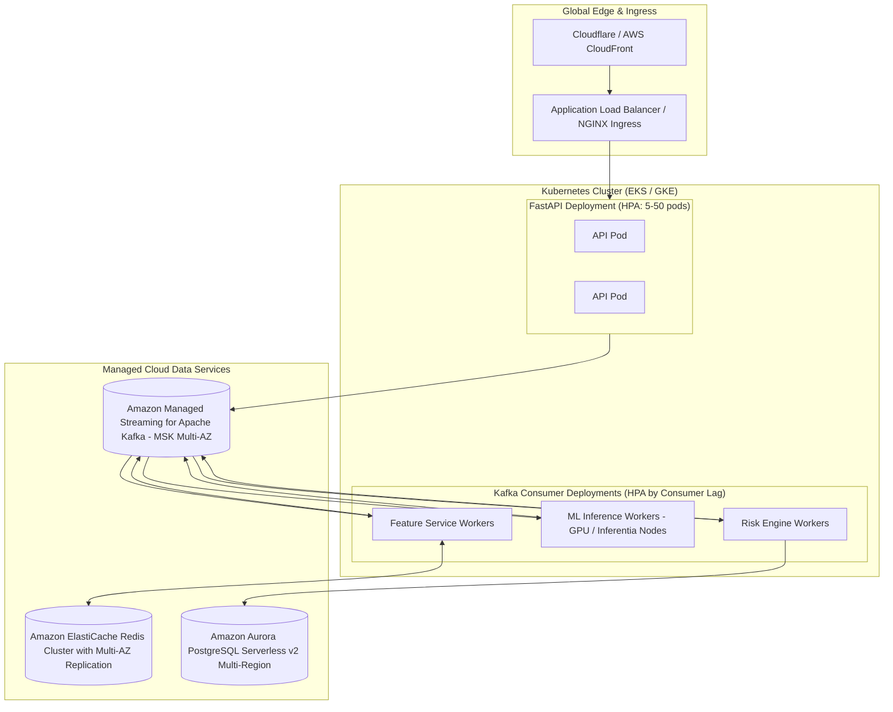

# Deployment, Orchestration & Operations Guide

---

## 1. Local Development Orchestration (Docker Compose)

The primary operating environment is an isolated, multi-container Docker Compose deployment.

### 1.1 Startup Sequence

```bash
# 1. Clone repository and initialize environment variables
git clone <repo-url>
cd "real-time-payment and fraud detection"
cp .env.example .env

# 2. Boot foundational state stores (Postgres, Redis, Kafka, Zookeeper)
docker compose up -d postgres redis zookeeper kafka

# 3. Wait for database and Kafka readiness (approx 10-15s)
docker compose ps

# 4. Launch all application microservices, UI, and observability
docker compose up -d --build
```

### 1.2 Service Verification Endpoints
- **FastAPI OpenAPI UI**: [http://localhost:8000/docs](http://localhost:8000/docs)
- **FastAPI Health**: [http://localhost:8000/api/v1/health](http://localhost:8000/api/v1/health)
- **Next.js Dashboard**: [http://localhost:3000](http://localhost:3000)
- **Prometheus UI**: [http://localhost:9090](http://localhost:9090)
- **Grafana Monitoring**: [http://localhost:3001](http://localhost:3001) (Credentials: `admin`/`admin`)

---

## 2. Service-Specific Initialization Lifecycle

1. **Database Schema Setup (`database/schema.sql`)**:
   PostgreSQL automatically executes scripts mounted in `/docker-entrypoint-initdb.d/schema.sql` on first boot, provisioning all tables, constraints, and indexes.
2. **Kafka Topic Provisioning**:
   An init container (`kafka-setup`) verifies the Kafka broker is responding and runs `kafka-topics --create --if-not-exists` for all required topics (`transactions.raw`, `transactions.features`, etc.).
3. **ML Model Loading**:
   On startup, the Inference Service and FastAPI check `MODEL_REGISTRY_PATH` (`ml/models/saved/`). If trained artifacts exist, they are loaded into memory (`joblib.load`). If absent, a default bootstrap baseline model is initialized.

---

## 3. Teardown & Reset Commands

```bash
# Stop all services gracefully
docker compose down

# Stop and wipe persistent volume data (clean slate reset)
docker compose down -v
```

---

## 4. Future Production Blueprint (FUTURE / NOT IMPLEMENTED)

> [!NOTE]
> **Status: ARCHITECTURAL DESIGN ONLY (NOT IMPLEMENTED IN THIS REPO)**  
> The section below describes how this platform would scale in a distributed cloud environment (e.g., AWS/GCP/Kubernetes). Do not claim these resources exist in the current local setup.



### Production Scaling Constraints to Address in Future:
- **Distributed Locks**: Multi-master Redis write conflict resolution using Redlock or partition-pinned routing.
- **Triton Inference Server**: Serving XGBoost via NVIDIA Triton or ONNX Runtime with dynamic batching to achieve $< 2$ ms p99 model latency at scale.
- **CDC (Change Data Capture)**: Debezium streaming PostgreSQL transaction audits to Snowflake / BigQuery data warehouse for analytical modeling.
