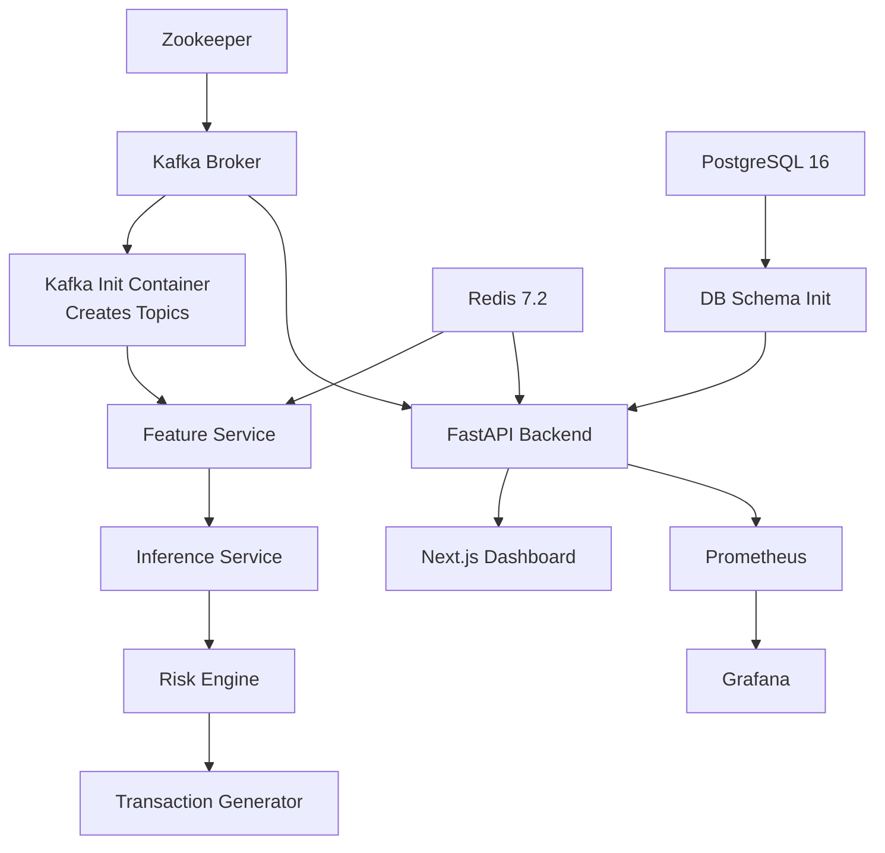

# Infrastructure & Deployment Specification

---

## 1. Container Topology & Docker Network Architecture

The fraud detection platform runs as a coordinated multi-container topology orchestrated by Docker Compose within a unified bridge network (`fraud-engine-net`).

```text
                               Docker Network: fraud-engine-net (172.28.0.0/16)
 ┌──────────────────────────────────────────────────────────────────────────────────────────────────┐
 │                                                                                                  │
 │  ┌─────────────────┐       ┌─────────────────┐       ┌─────────────────┐       ┌──────────────┐  │
 │  │   Next.js UI    │       │   FastAPI App   │       │ Feature Service │       │ ML Inference │  │
 │  │   (Port 3000)   │       │   (Port 8000)   │       │   (Consumer)    │       │  (Consumer)  │  │
 │  └────────┬────────┘       └────────┬────────┘       └────────┬────────┘       └──────┬───────┘  │
 │           │                         │                         │                       │          │
 │           └─────────────────────────┼─────────────────────────┼───────────────────────┘          │
 │                                     ▼                         ▼                                  │
 │                      ┌─────────────────────────────┐   ┌─────────────────────────────┐           │
 │                      │      PostgreSQL 16          │   │         Redis 7.2           │           │
 │                      │       (Port 5432)           │   │        (Port 6379)          │           │
 │                      └─────────────────────────────┘   └─────────────────────────────┘           │
 │                                     ▲                         ▲                                  │
 │                                     │                         │                                  │
 │                               ┌─────┴─────────────────────────┴─────┐                            │
 │                               │         Apache Kafka 3.6            │                            │
 │                               │            (Port 9092)              │                            │
 │                               └──────────────────┬──────────────────┘                            │
 │                                                  │                                               │
 │                                       ┌──────────┴──────────┐                                    │
 │                                       │      Zookeeper      │                                    │
 │                                       │     (Port 2181)     │                                    │
 │                                       └─────────────────────┘                                    │
 │                                                                                                  │
 │  ┌────────────────────────────────────────────────────────────────────────────────────────────┐  │
 │  │                                    Observability Subsystem                                 │  │
 │  │        Prometheus (Port 9090)                 ───►             Grafana (Port 3001)         │  │
 │  └────────────────────────────────────────────────────────────────────────────────────────────┘  │
 └──────────────────────────────────────────────────────────────────────────────────────────────────┘
```

---

## 2. Container Catalog & Port Allocations

| Container Name | Base Image | Host Port | Internal Port | Memory Limit | Health Check |
| :--- | :--- | :--- | :--- | :--- | :--- |
| `fraud-zookeeper` | `confluentinc/cp-zookeeper:7.5.0` | `2181` | `2181` | 512 MB | `nc -z localhost 2181` |
| `fraud-kafka` | `confluentinc/cp-kafka:7.5.0` | `9092`, `29092` | `9092`, `29092` | 1024 MB | `kafka-broker-api-versions --bootstrap-server localhost:9092` |
| `fraud-postgres` | `postgres:16-alpine` | `5432` | `5432` | 512 MB | `pg_isready -U postgres -d fraud_engine` |
| `fraud-redis` | `redis:7.2-alpine` | `6379` | `6379` | 512 MB | `redis-cli ping` |
| `fraud-api` | `python:3.11-slim` | `8000` | `8000` | 512 MB | `curl -f http://localhost:8000/api/v1/health` |
| `fraud-feature-svc` | `python:3.11-slim` | N/A | N/A | 512 MB | Internal process heartbeat |
| `fraud-inference-svc`| `python:3.11-slim` | N/A | N/A | 1024 MB | Internal process heartbeat |
| `fraud-risk-engine` | `python:3.11-slim` | N/A | N/A | 512 MB | Internal process heartbeat |
| `fraud-generator` | `python:3.11-slim` | N/A | N/A | 256 MB | Internal loop status |
| `fraud-dashboard` | `node:18-alpine` | `3000` | `3000` | 512 MB | `curl -f http://localhost:3000` |
| `fraud-prometheus` | `prom/prometheus:v2.48.0` | `9090` | `9090` | 256 MB | `wget --spider http://localhost:9090/-/healthy` |
| `fraud-grafana` | `grafana/grafana:10.2.0` | `3001` | `3000` | 256 MB | `curl -f http://localhost:3000/api/health` |

---

## 3. Persistent Volumes

| Volume Name | Driver | Container Mount Target | Purpose |
| :--- | :--- | :--- | :--- |
| `postgres_data` | local | `/var/lib/postgresql/data` | Transaction durability, enriched features, audit records, model versions. |
| `redis_data` | local | `/data` | AOF/RDB persistence for rolling behavioral windows and counters. |
| `kafka_data` | local | `/var/lib/kafka/data` | Commit log partitions for all Kafka topics. |
| `zookeeper_data` | local | `/var/lib/zookeeper/data` | Zookeeper epoch, coordination state, and transaction logs. |
| `prometheus_data` | local | `/prometheus` | Time-series metrics storage (scrape history, retention 15d). |
| `grafana_data` | local | `/var/lib/grafana` | Custom dashboard JSONs, data sources, user configurations. |

---

## 4. Kafka Streaming Configuration & Topic Catalog

All topics are configured with replication factor `1` (for single-node development) and retention policy matching functional needs:

| Topic Name | Partitions | Retention | Key Schema | Value Payload Description |
| :--- | :--- | :--- | :--- | :--- |
| `transactions.raw` | 3 | 24 Hours | `customer_id` | Raw incoming transaction event (amount, currency, merchant, device, location). |
| `transactions.features` | 3 | 24 Hours | `customer_id` | Raw event enriched with $\ge 25$ real-time Redis behavioral features. |
| `transactions.predictions`| 3 | 24 Hours | `customer_id` | Features + model raw scores, calibrated probabilities, anomaly score, and SHAP vectors. |
| `transactions.decisions` | 3 | 7 Days | `customer_id` | Final evaluated risk score (0–100), decision (`APPROVE`, `REVIEW`, `BLOCK`), triggered rules. |
| `transactions.feedback` | 1 | 90 Days | `transaction_id` | Ground-truth labels submitted by fraud analysts (disputes, chargebacks, confirmed fraud). |
| `transactions.dlq` | 1 | 30 Days | `transaction_id` | Malformed, deserialization-failed, or unrecoverable processing errors. |

---

## 5. Redis In-Memory State Configuration

- **Max Memory Policy**: `allkeys-lru` (Evicts least recently used keys when memory reaches ceiling).
- **Persistence Policy**: Hybrid RDB snapshots (every 5 minutes if $\ge 100$ keys modified) + AOF (`appendfsync everysec`).
- **Key Namespace Design**:
  - `cust:{id}:vel:1m` $\to$ Redis `INCR` counter with TTL 60s.
  - `cust:{id}:vel:1h` $\to$ Redis `INCR` counter with TTL 3600s.
  - `cust:{id}:window` $\to$ Redis `ZSET` containing `(timestamp, amount)` with TTL 7 days.
  - `cust:{id}:devices` $\to$ Redis `SET` storing known device identifiers with TTL 90 days.
  - `cust:{id}:countries` $\to$ Redis `SET` storing known country codes with TTL 90 days.
  - `idemp:{hash}` $\to$ Redis `SETNX` key with TTL 24 hours storing cached decision.

---

## 6. Startup Order & Dependency Lifecycle

To prevent container crashes and race conditions upon startup, services enforce strict dependencies:



---

## 7. Graceful Shutdown & Recovery Behavior

1. **Kafka Consumers**: Implement `SIGTERM`/`SIGINT` interceptors. Upon receiving termination signals, consumers pause consumption, commit current consumer group offsets synchronously, and close sessions cleanly to prevent consumer group rebalance storms.
2. **PostgreSQL**: Gracefully drains active connection pools.
3. **Redis**: Issues a `BGSAVE` snapshot upon shutdown to preserve in-flight rolling behavioral statistics.
