# Distributed Streaming Architecture & Kafka Specification

---

## 1. Streaming Topography & Topic Flow

The streaming backbone utilizes Apache Kafka to provide durable, ordered, replayable, and horizontally scalable event passing between microservices:

```mermaid
flowchart LR
    GEN[Transaction Generator] -->|Publish| RAW[(transactions.raw)]
    
    subgraph FS_GROUP[Consumer Group: feature-enrichment-group]
        FS1[Feature Consumer Worker 1]
        FS2[Feature Consumer Worker 2]
    end
    RAW --> FS_GROUP
    
    FS_GROUP -->|Publish| FEAT[(transactions.features)]
    
    subgraph INF_GROUP[Consumer Group: ml-inference-group]
        INF1[ML Inference Worker 1]
        INF2[ML Inference Worker 2]
    end
    FEAT --> INF_GROUP
    
    INF_GROUP -->|Publish| PRED[(transactions.predictions)]
    
    subgraph RISK_GROUP[Consumer Group: risk-decision-group]
        RE1[Risk Engine Worker 1]
        RE2[Risk Engine Worker 2]
    end
    PRED --> RISK_GROUP
    
    RISK_GROUP -->|Publish| DEC[(transactions.decisions)]
    
    FS_GROUP -.->|Corrupted Payload| DLQ[(transactions.dlq)]
    INF_GROUP -.->|Inference Failure| DLQ
    RISK_GROUP -.->|Execution Error| DLQ
```



---

## 2. Topic Catalog & Message Schemas

### 2.1 `transactions.raw`
- **Key**: `customer_id` (Ensures strict chronological ordering per customer partition).
- **Format**: JSON
- **Sample Payload**:
```json
{
  "transaction_id": "TXN-90214",
  "timestamp": "2026-10-01T12:30:00Z",
  "customer_id": "CUST-4019",
  "merchant_id": "MERCH-8102",
  "amount": 1450.00,
  "currency": "INR",
  "country": "IN",
  "city": "Mumbai",
  "device_id": "DEV-MUMBAI-01",
  "payment_method": "UPI",
  "ip_address": "49.36.12.8"
}
```

### 2.2 `transactions.features`
- **Key**: `customer_id`
- **Format**: JSON
- **Content**: Original raw payload + `features` object containing 25+ real-time computed rolling metrics.

### 2.3 `transactions.predictions`
- **Key**: `customer_id`
- **Format**: JSON
- **Content**: Raw payload + features + `model_outputs` (`raw_score`, `calibrated_probability`, `anomaly_score`, `shap_drivers`, `model_version`).

### 2.4 `transactions.decisions`
- **Key**: `customer_id`
- **Format**: JSON
- **Content**: Complete transaction evaluation including `risk_score` (0–100), `decision` (`APPROVE`/`REVIEW`/`BLOCK`), `triggered_rules`, and timestamp.

### 2.5 `transactions.feedback`
- **Key**: `transaction_id`
- **Format**: JSON
- **Content**: Confirmed dispute and chargeback outcomes submitted by human fraud investigators.

### 2.6 `transactions.dlq` (Dead Letter Queue)
- **Key**: `transaction_id` or `error_uuid`
- **Format**: JSON
- **Content**: Failed original message payload, error type, exception stack trace, failed step name, and timestamp.

---

## 3. Partitioning Strategy & Ordering Guarantees

1. **Why Partition by `customer_id`?**
   Kafka guarantees FIFO ordering *only within a single partition*. 
   By hashing `customer_id` as the message key, all transactions initiated by a specific cardholder are guaranteed to land on the same partition and be consumed sequentially by the same consumer worker.
2. **Preventing Race Conditions**:
   If two transactions for Customer A arrive 50 milliseconds apart, partitioning by `customer_id` guarantees that Transaction 1 updates the customer's Redis state before Transaction 2 reads that state, eliminating split-brain concurrency errors.

---

## 4. Consumer Offset Management & Commit Policy

To achieve **at-least-once delivery** without message loss:
- `enable.auto.commit`: Set to `false`.
- Consumers explicitly commit offsets (`commitSync()` / `commitAsync()`) *only after*:
  1. The transaction has been processed,
  2. Any backing state cache has been updated, and
  3. The resulting event has been written to the downstream Kafka topic or durable database.
- If a consumer container crashes mid-processing, Kafka unassigns the partition and triggers a rebalance; the newly assigned consumer resumes from the last committed offset.

---

## 5. Idempotent Processing & Deduplication

In distributed networks, network retries and consumer rebalances cause duplicate messages. 
A payment fraud engine must never double-count transactions or generate conflicting risk decisions for the same payment.

### Implementation:
1. **Idempotency Key Construction**:
   $$\text{IdempKey} = \text{SHA256}(\text{transaction\_id} \parallel \text{customer\_id} \parallel \text{amount} \parallel \text{timestamp})$$
2. **Redis Fast-Check (`SETNX`)**:
   Before running feature calculations, the service checks Redis:
   ```python
   is_new = redis.set(f"idemp:{idemp_key}", "IN_PROGRESS", nx=True, ex=86400)
   if not is_new:
       logger.warning(f"Duplicate transaction {transaction_id} detected. Skipping pipeline.")
       return
   ```
3. **Database Unique Constraint**:
   PostgreSQL enforces `UNIQUE(transaction_id)` and `UNIQUE(idempotency_key)`. Any duplicate insert attempt triggers an `ON CONFLICT DO NOTHING` or returns the previously recorded decision.

---

## 6. Error Handling & Dead Letter Queue (DLQ) Lifecycle

1. **Transient Errors (Redis/Postgres timeouts)**:
   Retried with exponential backoff and jitter (e.g., 100ms, 200ms, 400ms, up to 3 attempts).
2. **Permanent Errors (JSON Deserialization, Schema Corruption)**:
   Immediately routed to `transactions.dlq`.
3. **DLQ Replay Mechanism**:
   A dedicated administrative script (`services/dlq_consumer.py`) enables operators to inspect malformed payloads, patch schema bugs, and re-inject events into `transactions.raw`.
